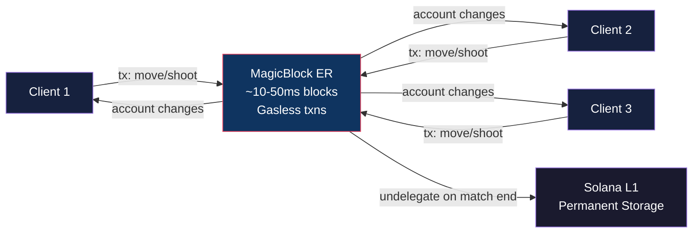
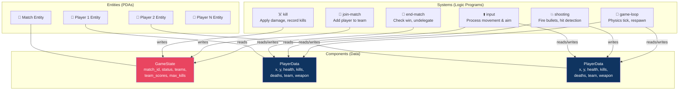
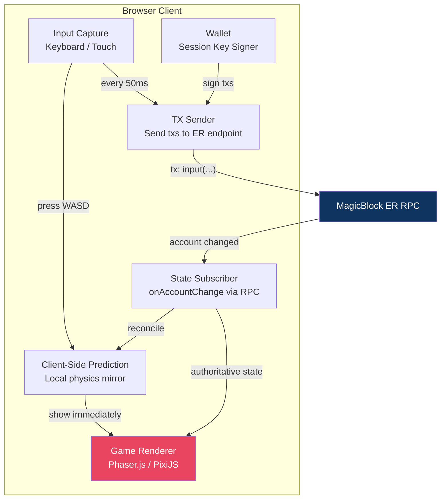

# 🎮 Onchain Mini Militia — Full ER Architecture (Solana + MagicBlock)

> **Architecture:** Full Ephemeral Rollup — ALL game logic runs onchain inside MagicBlock ER
> **Reference:** [magicblock-labs/bolt-shooter](https://github.com/magicblock-labs/bolt-shooter)

---

## Core Principle

```
Every action is a Solana transaction sent to the ER.
The ER IS your game server. No web2 backend.
```



---

## Full Match Lifecycle

```mermaid
sequenceDiagram
    participant C as 🎮 Clients
    participant L1 as 🔗 Solana L1
    participant ER as ⚡ MagicBlock ER

    Note over L1: PlayerProfile PDAs exist on L1

    rect rgb(20, 30, 50)
        Note over C,L1: 1️⃣ MATCH SETUP (Solana L1)
        C->>L1: Create MatchState PDA (World + Entity)
        C->>L1: Attach components (GameState, PlayerData)
    end

    rect rgb(30, 50, 30)
        Note over L1,ER: 2️⃣ DELEGATION (one-time ~200ms)
        L1->>ER: Delegate MatchState account to ER
        Note over ER: ER now owns the account<br/>L1 account is locked but readable
    end

    rect rgb(50, 20, 20)
        Note over C,ER: 3️⃣ GAME SESSION (all inside ER, real-time)
        loop Every player input (~10-50ms per tick)
            C->>ER: tx: input(player, dx, dy, angle, shooting)
            ER->>ER: game-loop system processes physics
            ER->>ER: shooting system checks hits
            ER->>ER: kill system updates scores
            ER-->>C: onAccountChange → render updated state
        end
    end

    rect rgb(50, 50, 20)
        Note over ER,L1: 4️⃣ MATCH END (score target reached)
        ER->>ER: Game-over condition met onchain
        ER->>L1: commit_and_undelegate → final state to L1
        L1->>L1: Update PlayerProfile stats
        L1->>C: Distribute rewards (SPL tokens)
    end
```



---

## BOLT ECS Architecture

BOLT uses the **Entity Component System** pattern on Solana:
- **Entity** = A unique ID (like a game object)
- **Component** = Data attached to an entity (position, health, score)
- **System** = Logic that processes components (movement, shooting, damage)



---

## Onchain Account Design

### Component: GameState (attached to Match Entity)

```rust
use bolt_lang::*;

#[component]
pub struct GameState {
    // Match info
    pub match_id: u64,
    pub status: u8,              // 0=Waiting, 1=Active, 2=Finished
    pub max_players: u8,         // 6 (3v3)
    pub kill_target: u8,         // e.g., 20 kills to win

    // Teams
    pub team1_players: [Pubkey; 3],
    pub team2_players: [Pubkey; 3],
    pub team1_count: u8,
    pub team2_count: u8,
    pub team1_kills: u16,
    pub team2_kills: u16,

    // Timing
    pub started_at: i64,
    pub match_duration: u16,     // max seconds

    // Winner
    pub winner_team: u8,         // 0=none, 1=team1, 2=team2
}
```

### Component: PlayerData (attached to each Player Entity)

```rust
use bolt_lang::*;

#[component]
pub struct PlayerData {
    // Identity
    pub authority: Pubkey,       // wallet
    pub team: u8,                // 1 or 2
    pub is_alive: bool,

    // Position & Movement
    pub x: i32,                  // fixed-point (multiply by 100 for precision)
    pub y: i32,
    pub velocity_x: i16,
    pub velocity_y: i16,
    pub facing_angle: u16,       // 0-360 degrees * 100

    // Combat
    pub health: u8,              // 0-100
    pub weapon: u8,              // 0=pistol, 1=shotgun, 2=sniper, etc.
    pub ammo: u16,
    pub is_shooting: bool,

    // Stats (this match)
    pub kills: u8,
    pub deaths: u8,

    // Respawn
    pub respawn_timer: u8,       // countdown in ticks
}
```

### Account: PlayerProfile (Solana L1 — permanent, NOT delegated)

```rust
use anchor_lang::prelude::*;

#[account]
pub struct PlayerProfile {
    pub authority: Pubkey,
    pub game_name: [u8; 16],     // fixed-size for efficiency
    pub rank: u16,               // ELO
    pub total_kills: u32,
    pub total_deaths: u32,
    pub total_games: u32,
    pub total_wins: u32,
    pub created_at: i64,
}
// Seeds: [b"player", authority.as_ref()]
// Lives on Solana L1, never delegated
```

---

## System Breakdown — What Each Program Does

### 1. `system-join-match` — Player joins a team

```
Input:  player wallet, match entity
Action: Add player pubkey to team1 or team2
        Create player entity with PlayerData
        Assign spawn position based on team
Check:  Match not full, match status == Waiting
```

### 2. `system-input` — Process player movement & aim

```
Input:  dx, dy (movement delta), angle (aim), shooting (bool)
Action: Update player's x, y based on dx/dy
        Clamp to map boundaries
        Update facing_angle
        Set is_shooting flag
Runs:   Every client input (~50-100ms intervals)
```

### 3. `system-game-loop` — Physics tick (runs via clockwork/crank)

```
Input:  Match entity + all player entities
Action: Apply velocity to positions
        Check map collisions
        Process respawn timers (decrement, revive if 0)
        Check match duration timeout
Runs:   Cranked at ~20 ticks/sec by a backend crank service
```

> [!IMPORTANT]
> **The game-loop needs a crank!** Someone must call this system repeatedly. Options:
> - **Clockwork** (Solana automation protocol)
> - **A simple backend script** that sends crank txs every 50ms
> - **One of the clients** takes turns cranking (peer-based)

### 4. `system-shooting` — Bullet hitscans

```
Input:  Shooter entity, all other player entities
Action: Ray cast from shooter position at facing_angle
        Check intersection with other players (AABB or circle collision)
        If hit: reduce target health by weapon damage
        If health <= 0: mark target as dead
Runs:   When player's is_shooting == true during game-loop
```

### 5. `system-kill` — Record a kill

```
Input:  Killer entity, victim entity, match entity
Action: Increment killer.kills
        Increment victim.deaths
        Increment team_kills for killer's team
        Set victim.is_alive = false
        Set victim.respawn_timer = 50 (5 seconds at 10 ticks)
Check:  If team_kills >= kill_target → trigger match end
```

### 6. `system-end-match` — Finalize and undelegate

```
Input:  Match entity
Action: Set status = Finished
        Set winner_team
        Call commit_and_undelegate() → push state to Solana L1
        Update PlayerProfile stats on L1
        Distribute SOL/token rewards
Runs:   Once, when kill target is reached
```

---

## Client Architecture (Browser)



### Client Flow:

```
1. Player presses "D" (move right)
2. Client-side prediction: immediately render player moving right
3. Client sends tx to ER: input(dx=5, dy=0, angle=90, shooting=false)
4. ER processes in next block (~10-50ms)
5. ER account updates → client receives via onAccountChange
6. Client reconciles: if ER position ≠ predicted position, smoothly correct
7. Other players see your movement via their own onAccountChange subscription
```

### Session Keys (Important!)

Players can't sign every tx with their wallet popup. Use **session keys**:

```
Match start → Generate ephemeral keypair in browser
            → Approve session key on L1 (1 wallet popup)
            → All ER txs signed by session key (no popups during game)
Match end   → Session key expires
```

---

## Folder Structure

```
mini-militia/
├── programs-ecs/
│   ├── components/
│   │   ├── game-state/          # Match state component
│   │   │   └── src/lib.rs
│   │   └── player-data/         # Player state component
│   │       └── src/lib.rs
│   └── systems/
│       ├── join-match/          # Add player to team
│       │   └── src/lib.rs
│       ├── input/               # Process WASD + aim + shoot
│       │   └── src/lib.rs
│       ├── game-loop/           # Physics tick (cranked)
│       │   └── src/lib.rs
│       ├── shooting/            # Hit detection + damage
│       │   └── src/lib.rs
│       ├── kill/                # Record kill + check win condition
│       │   └── src/lib.rs
│       └── end-match/           # Undelegate + settle rewards
│           └── src/lib.rs
├── programs/
│   ├── player-profile/          # L1 permanent stats (Anchor)
│   │   └── src/lib.rs
│   └── reward-system/           # Token distribution (Anchor)
│       └── src/lib.rs
├── app/
│   └── client/                  # Browser game client
│       ├── src/
│       │   ├── game/            # Phaser/PixiJS renderer
│       │   ├── network/         # ER connection + subscriptions
│       │   ├── prediction/      # Client-side prediction
│       │   └── wallet/          # Wallet + session keys
│       └── package.json
├── tests/
│   └── mini-militia.ts          # Integration tests
├── Anchor.toml
└── Cargo.toml
```

---

## Data Flow — Complete Picture

```
┌─────────────────────────────────────────────────────────────────┐
│                    SOLANA L1 (Permanent)                        │
│                                                                 │
│  PlayerProfile PDAs     Reward Token Mint     Match History     │
│  [wallet, rank, stats]  [SPL Token]           [completed PDAs]  │
└────────────┬──────────────────────────────────┬─────────────────┘
             │ delegate at match start          │ undelegate at match end
             ▼                                  ▲
┌─────────────────────────────────────────────────────────────────┐
│                    MAGICBLOCK ER (Session)                       │
│                    ~10-50ms blocks, gasless                      │
│                                                                 │
│  MatchState Entity ─── GameState Component                      │
│       │                [teams, scores, status]                  │
│       │                                                         │
│       ├── Player1 Entity ─── PlayerData Component               │
│       │                      [x, y, health, kills, weapon]      │
│       ├── Player2 Entity ─── PlayerData Component               │
│       ├── Player3 Entity ─── PlayerData Component               │
│       ├── Player4 Entity ─── PlayerData Component               │
│       ├── Player5 Entity ─── PlayerData Component               │
│       └── Player6 Entity ─── PlayerData Component               │
│                                                                 │
│  Systems running:                                               │
│    input()    → every client tx (~50ms)                         │
│    game-loop()→ cranked ~20 ticks/sec                           │
│    shooting() → during game-loop when is_shooting               │
│    kill()     → when health reaches 0                           │
│                                                                 │
└────────────┬────────────────────────────────────────────────────┘
             │ onAccountChange (WebSocket subscription)
             ▼
┌─────────────────────────────────────────────────────────────────┐
│                    BROWSER CLIENTS (6 players)                  │
│                                                                 │
│  [Input] → [Prediction] → [Render]                             │
│       └→ [Send tx to ER] → [Receive account updates] → [Reconcile] │
│                                                                 │
│  Session Key signer (no wallet popups during game)              │
└─────────────────────────────────────────────────────────────────┘
```

---

## The Crank Problem & Solutions

The `game-loop` system needs to be called repeatedly (it does physics, respawns, timeout checks). Someone must "crank" it.

| Option | How | Pros | Cons |
|--------|-----|------|------|
| **Clockwork** | Solana automation, scheduled txs | Decentralized, reliable | May have latency, costs $ |
| **Backend Crank Script** | Simple Node/Rust script sends crank tx every 50ms | Fast, controllable | Centralized (but only for tick, not for game logic) |
| **Client Crank** | Each client takes turns cranking | No server needed | Unreliable if player disconnects |
| **bolt-shooter approach** | Backend crank service | Used in production | Slight centralization tradeoff |

> [!TIP]
> **Start with a backend crank script.** It's the simplest — just a loop that sends 1 tx every 50ms to the ER. The game logic is still 100% onchain and verifiable, the crank just triggers the tick.

---

## Tech Stack

| Layer | Tech | Why |
|-------|------|-----|
| **Onchain Framework** | BOLT (built on Anchor) | ECS pattern, delegation built-in |
| **Components/Systems** | Rust | BOLT components + systems are Rust programs |
| **Client Renderer** | Phaser.js or PixiJS | 2D game engine, Canvas/WebGL |
| **Client Framework** | React + Vite | UI shell around the game canvas |
| **ER Connection** | `@solana/web3.js` | Connect to ER RPC endpoint |
| **Wallet** | Solana Wallet Adapter | Standard wallet connect |
| **Session Keys** | `@magicblock-labs/session-keys` | Sign txs without popups |
| **Crank Service** | Node.js or Rust script | Calls game-loop every 50ms |
| **Testing** | `anchor test` + bankrun | Test systems locally |

---

## Why This Works for Mini Militia

| Concern | Answer |
|---------|--------|
| **"10-50ms is too slow for a shooter"** | Mini Militia is a casual mobile game, not CS:GO. 50ms is fine. bolt-shooter proves it. |
| **"Every action as a tx is expensive"** | ER transactions are **gasless**. Zero cost during the session. |
| **"Physics in Rust is hard"** | For a 2D game it's simple: AABB collision, ray casting, fixed-point math. bolt-shooter already does it. |
| **"What about cheating?"** | Impossible. All logic runs onchain. You can't fake a kill or teleport. |
| **"What if ER goes down?"** | Accounts are still on L1 (locked). Match can be recovered or force-undelegated. |
| **"Scalability with 6 players?"** | Each match is its own ER session. 100 matches = 100 independent ERs. Scales horizontally. |

---

## Implementation Phases

### Phase 1: Core Onchain (Week 1-2)
- [ ] Set up BOLT project with `bolt init`
- [ ] Implement `GameState` and `PlayerData` components
- [ ] Build `join-match` and `input` systems
- [ ] Build `game-loop` with basic movement physics
- [ ] Test with `anchor test`

### Phase 2: Combat (Week 2-3)
- [ ] Implement `shooting` system (hitscan/ray cast)
- [ ] Implement `kill` system (damage + death + score tracking)
- [ ] Implement `end-match` system (win condition + undelegate)
- [ ] Build `PlayerProfile` on L1 + stats update after match

### Phase 3: Client (Week 3-4)
- [ ] Set up Phaser.js / PixiJS game renderer
- [ ] Implement ER connection + account subscriptions
- [ ] Build client-side prediction + reconciliation
- [ ] Integrate session keys for gasless signing
- [ ] Build lobby UI (create/join match)

### Phase 4: Polish (Week 4-5)
- [ ] Crank service for game-loop
- [ ] Weapon variety + map design
- [ ] Reward system (SPL token distribution)
- [ ] Matchmaking / lobby system
- [ ] Deploy to devnet → test with friends

---

## Key Reference Repos

| Repo | What to learn |
|------|--------------|
| [bolt-shooter](https://github.com/magicblock-labs/bolt-shooter) | ECS structure, systems for shooter game, game-loop crank |
| [Unity.Shooter](https://github.com/magicblock-labs/Unity.Shooter) | Client-side rendering patterns |
| [bolt-tic-tac-toe](https://github.com/magicblock-labs/bolt-tic-tac-toe) | Delegation/undelegation flow, React client |
| [bolt](https://github.com/magicblock-labs/bolt) | BOLT framework source, `delegate.ts` / `undelegate.ts` |
| [ephemeral-rollups-sdk](https://github.com/magicblock-labs/ephemeral-rollups-sdk) | ER SDK, delegation helpers |
| [magicblock-engine-examples](https://github.com/magicblock-labs/magicblock-engine-examples) | Various ER integration examples |
