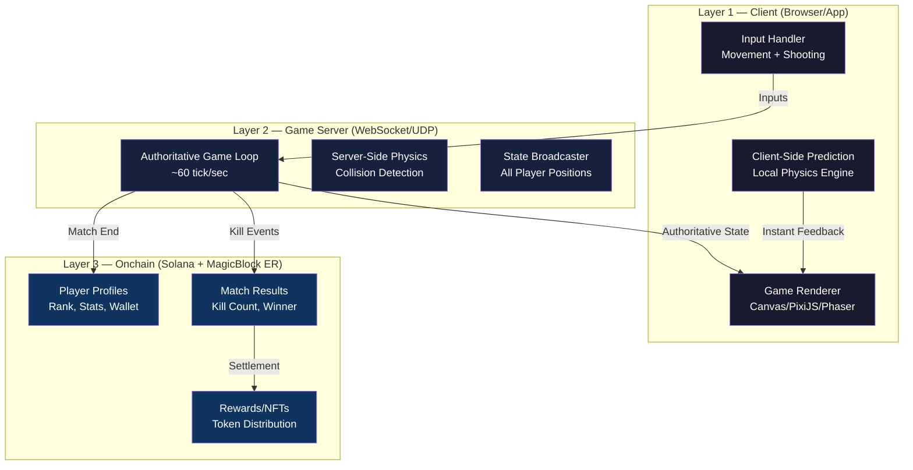

# 🎮 Onchain Mini Militia — Architecture Guide (Solana + MagicBlock)

## TL;DR — Can You Build It?

**Yes, it's absolutely possible** — but you need a **hybrid architecture**, not a "put everything onchain" approach. Here's why and how.

---

## ❌ The Problem With 100% Onchain (via MagicBlock)

Your instinct is right — putting **everything** through MagicBlock's delegation/undelegation cycle will bottleneck you:

| Concern | Reality |
|---------|---------|
| Solana block time | ~400ms per slot |
| MagicBlock ER latency | ~10-50ms (great for turns, bad for 60fps physics) |
| Delegation/Undelegation | Has overhead per account — not suitable for per-frame updates |
| Mini Militia needs | ~16ms tick rate (60fps), real-time bullet physics, instant movement |

> [!CAUTION]
> A 2D shooter like Mini Militia needs **sub-16ms** frame response for movement/shooting. Even MagicBlock's best-case 10ms ER latency is too slow if every position update needs an on-chain round-trip.

---

## ✅ The Recommended Hybrid Architecture

Split your game into **3 layers** based on what NEEDS to be onchain vs what should be fast:



---

## 🏗️ Layer Breakdown

### Layer 1 — Client (Real-Time Rendering)

**Purpose:** Instant visual feedback, no blockchain delay.

| Component | What it does |
|-----------|-------------|
| **Game Renderer** | Draws players, bullets, map at 60fps |
| **Client-Side Prediction** | When you press "move right", your character moves INSTANTLY locally |
| **Input Handler** | Captures keyboard/touch inputs, sends to game server |

> [!TIP]
> **Client-side prediction** is the secret sauce. The player sees instant movement. The server corrects if there's a mismatch. This is exactly how every real-time game works (Counter-Strike, Fortnite, etc.)

### Layer 2 — Game Server (Authoritative Logic)

**Purpose:** Single source of truth for physics, anti-cheat, broadcasting.

| Component | What it does |
|-----------|-------------|
| **Game Loop** | Runs at ~60 ticks/sec, processes all player inputs |
| **Physics Engine** | Collision detection, bullet trajectories, damage calculation |
| **State Broadcaster** | Sends updated positions to ALL connected clients via WebSocket |

```
Client A presses "shoot" 
  → WebSocket → Game Server processes bullet trajectory
  → Broadcasts "Player A shot at (x,y)" to ALL clients
  → Each client renders the bullet locally
  → Server confirms hit/miss → broadcasts result
```

> [!IMPORTANT]
> The game server is **NOT onchain**. It's a regular Node.js/Rust server using WebSocket or UDP for real-time communication. This is where your whiteboard's "Game Session" box fits.

### Layer 3 — Onchain (Solana + MagicBlock)

**Purpose:** Verifiable results, permanent stats, rewards.

**What goes onchain:**

| Data | When | How |
|------|------|-----|
| **Player Registration** | On signup | Solana transaction → create PDA with pubkey, name, rank |
| **Match Start** | When match begins | Delegate match account to MagicBlock ER |
| **Kill Events** | During match (batched) | Via MagicBlock ER — batch every 5-10 seconds |
| **Match Result** | On match end | Undelegate → commit final state to Solana L1 |
| **Rewards** | Post-match | SPL token transfer based on results |

---

## 🔀 Data Flow — Full Match Lifecycle

```mermaid
sequenceDiagram
    participant Client as 🎮 Client
    participant WS as 🔌 WebSocket Server
    participant ER as ⚡ MagicBlock ER
    participant L1 as 🔗 Solana L1

    Note over L1: Player Profile PDA exists on L1

    Client->>WS: Connect to lobby
    WS->>ER: Create & delegate match account
    ER-->>WS: Match account ready

    rect rgb(30, 40, 60)
        Note over Client,WS: ⏱️ REAL-TIME GAME LOOP (WebSocket, 60 tick/sec)
        Client->>WS: Input: move(dx, dy)
        WS->>WS: Physics tick → update positions
        WS-->>Client: Broadcast: all player states
        Client->>WS: Input: shoot(angle)
        WS->>WS: Bullet collision check
        WS-->>Client: Broadcast: hit/kill event
    end

    rect rgb(20, 50, 40)
        Note over WS,ER: 📦 BATCH ONCHAIN UPDATES (every ~5-10 sec)
        WS->>ER: Batch: player_kills[], scores
        ER-->>WS: Confirmed
    end

    rect rgb(50, 30, 30)
        Note over WS,L1: 🏁 MATCH END
        WS->>ER: Final state: winner, kills, duration
        ER->>L1: Undelegate → commit to L1
        L1->>L1: Update player stats PDA
        L1->>Client: Distribute rewards (SPL tokens)
    end
```



---

## 🧩 Onchain Account Design (Solana PDAs)

Based on your whiteboard, here's the refined onchain structure:

### Player Profile (Solana L1 — Permanent)

```rust
#[account]
pub struct PlayerProfile {
    pub authority: Pubkey,       // wallet
    pub game_name: String,       // max 16 chars
    pub rank: u16,               // ELO or similar
    pub total_kills: u32,
    pub total_deaths: u32,
    pub total_games: u32,
    pub total_wins: u32,
    pub created_at: i64,
}
// Seeds: [b"player", authority.key().as_ref()]
```

### Match Account (Delegated to MagicBlock ER during game)

```rust
#[account]
pub struct MatchState {
    pub match_id: u64,
    pub team1: [Option<Pubkey>; 3],  // max 3 per team (6 total)
    pub team2: [Option<Pubkey>; 3],
    pub team1_kills: u8,
    pub team2_kills: u8,
    pub status: MatchStatus,         // Waiting, Active, Completed
    pub winner: Option<u8>,          // 1 or 2
    pub started_at: i64,
    pub ended_at: Option<i64>,
}
// Seeds: [b"match", match_id.to_le_bytes()]
```

### Kill Record (Written in MagicBlock ER → settled to L1)

```rust
#[account]
pub struct KillRecord {
    pub match_id: u64,
    pub killer: Pubkey,
    pub victim: Pubkey,
    pub weapon: u8,
    pub timestamp: i64,
}
```

---

## ⚡ Where MagicBlock Fits (And Where It Doesn't)

```
┌─────────────────────────────────────────────────────────┐
│                    DON'T use MagicBlock for:             │
│  ❌ Per-frame position updates (60fps = too fast)       │
│  ❌ Bullet physics / collision detection                │
│  ❌ Real-time player input processing                   │
│  ❌ Rendering state                                     │
└─────────────────────────────────────────────────────────┘

┌─────────────────────────────────────────────────────────┐
│                    DO use MagicBlock for:                │
│  ✅ Match state (start, end, winner)                    │
│  ✅ Kill events (batched every few seconds)             │
│  ✅ Score tracking during match                         │
│  ✅ Anti-cheat verification (server signs results)      │
│  ✅ Reward distribution triggers                        │
└─────────────────────────────────────────────────────────┘
```

---

## 🌐 Tech Stack Recommendation

| Layer | Technology | Why |
|-------|-----------|-----|
| **Client** | Phaser.js / PixiJS + React | Battle-tested 2D game engines with WebSocket support |
| **Game Server** | Node.js (Colyseus) or Rust | Colyseus = multiplayer game server framework with rooms, state sync built-in |
| **Networking** | WebSocket (reliable) + WebRTC (fast) | WS for game events, WebRTC DataChannel for position updates |
| **Onchain** | Anchor + MagicBlock BOLT SDK | Anchor for Solana programs, BOLT ECS for entity management |
| **Wallet** | Solana Wallet Adapter | Standard wallet integration |

> [!TIP]
> **Colyseus** (colyseus.io) is perfect for this — it handles rooms, matchmaking, state synchronization, and reconnection out of the box. It's what many web-based multiplayer games use.

---

## 🔄 Delegation/Undelegation — When Exactly?

Your concern about delegation delays is valid. Here's the optimized flow:

```
MATCH LIFECYCLE:

1. LOBBY → Player joins
   └─ Solana L1: Read player profile

2. MATCH FOUND → Create match
   └─ Solana L1: Create MatchState PDA
   └─ MagicBlock: DELEGATE match account to ER ← (one-time cost ~100-200ms)

3. GAME RUNNING → Real-time gameplay
   └─ WebSocket: All movement/shooting/physics
   └─ MagicBlock ER: Batch kill records every 5-10 sec (10-50ms each)

4. MATCH ENDS → Settle results  
   └─ Server: Send final state to ER
   └─ MagicBlock: UNDELEGATE → commit to Solana L1 ← (one-time cost ~200-400ms)
   └─ Solana L1: Update player profiles, distribute rewards

Total onchain overhead per match: ~2-4 transactions
```

> [!NOTE]
> Delegation and undelegation happen **once per match**, not per frame. The 30-40ms you're worried about is **only during the ER session** — and you're only sending batch updates there, not frame data.

---

## 🗺️ Mapping Your Whiteboard to This Architecture

From your diagram:

| Your Whiteboard | Maps To |
|----------------|---------|
| Client Connection | Layer 1 — WebSocket client with game renderer |
| User Registration (user_pubkey, game_name, rank, stats) | Layer 3 — `PlayerProfile` PDA on Solana L1 |
| Web Socket (game_session, max_player, kills) | Layer 2 — Colyseus/custom game server rooms |
| Magic Block (store every kill, user_pubkey, number_of_kills) | Layer 3 — Batched `KillRecord` via MagicBlock ER |
| User Wallet (stored in browser, proxy) | Solana Wallet Adapter with session keys |
| "After completion of match → broadcast to Solana" | Undelegation → final state committed to L1 |
| Research: UDP, Game Server | Layer 2 — Use WebRTC DataChannel for UDP-like speed |

---

## 🎯 Summary: The Golden Rule

> **Real-time action → WebSocket/WebRTC (offchain server)**
> **Verifiable results → MagicBlock ER (batched)**  
> **Permanent state → Solana L1 (settlement)**

Your game IS onchain — the results are provable, the rewards are real tokens, the stats are permanent on Solana. But the **gameplay** runs on a traditional game server because physics at 60fps simply cannot wait for any blockchain, even MagicBlock's ultra-fast ERs.

This is exactly how **Supersize** (MagicBlock's flagship game) and other production onchain games work.
