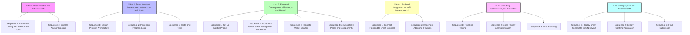

Sure! Here's a visual representation of your roadmap using a **Mermaid** flowchart. This should help you better understand and navigate through the different acts and sequences of your project plan.

### Overview of the Roadmap

1. **Act 1: Project Setup and Initialization**
   - **Sequence 1:** Install and configure all necessary development tools such as Node.js, Rust, Solana CLI, Anchor CLI, and Yarn.
   - **Sequence 2:** Initialize the Anchor project, set up the project directory, manage dependencies, and initialize a Git repository.

2. **Act 2: Smart Contract Development with Anchor and Rust**
   - **Sequence 1:** Design the program architecture, defining program goals, accounts, data structures, and instruction functions.
   - **Sequence 2:** Implement the program logic in `lib.rs`, define accounts and contexts, and handle custom errors.
   - **Sequence 3:** Write and run unit tests to ensure the smart contract functions as expected.

3. **Act 3: Frontend Development with Next.js and React**
   - **Sequence 1:** Set up the Next.js project with Tailwind CSS and install necessary dependencies.
   - **Sequence 2:** Implement global state management using Recoil.
   - **Sequence 3:** Integrate the Solana Wallet Adapter for wallet connectivity.
   - **Sequence 4:** Develop core pages and components such as the Swap page and SwapComponent.

4. **Act 4: Backend Integration and API Development**
   - **Sequence 1:** Connect the frontend to the smart contract using utility functions and handle errors.
   - **Sequence 2:** Implement additional features like liquidity pool management and staking mechanisms.

5. **Act 5: Testing, Optimization, and Security**
   - **Sequence 1:** Set up the frontend testing environment and write tests for components.
   - **Sequence 2:** Perform code review and optimization, including static code analysis and performance enhancements.
   - **Sequence 3:** Final polishing of the UI/UX, documentation, and preparing demo materials.

6. **Act 6: Deployment and Submission**
   - **Sequence 1:** Deploy the smart contract to the SOON Devnet.
   - **Sequence 2:** Deploy the frontend application to a hosting platform like Vercel.
   - **Sequence 3:** Final submission ensuring all requirements are met and engaging with the community.

### Benefits of This Visual Roadmap

- **Clarity:** Easily understand the flow of tasks and how each part of the project is interconnected.
- **Organization:** Keep track of progress within each act and sequence.
- **Efficiency:** Identify dependencies and prioritize tasks effectively to meet the hackathon deadline.
- **Collaboration:** Share the roadmap with team members to ensure everyone is aligned and aware of their responsibilities.

Feel free to modify the diagram as your project progresses or if you need to add more details. Good luck with your SOON Genesis Hackathon project!