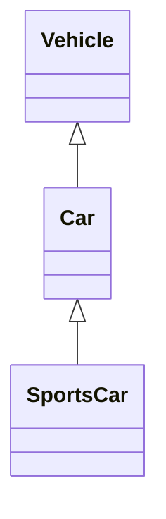

# Module 5: Inheritance (4L)

This comprehensive guide covers the essential topics of **Module 5: Inheritance** in Object-Oriented Programming (OOP). It provides clear and detailed explanations of each concept, complete with code examples to aid your understanding and preparation for the exam.

---

## 1. Single and Multiple Inheritance

### **Single Inheritance**

**Single Inheritance** involves a derived class (child class) inheriting from a single base class (parent class). This establishes a one-to-one relationship between classes.

#### **Example in C++**

```cpp:path/to/file/single_inheritance.cpp
#include <iostream>
using namespace std;

// Base class
class Animal {
public:
    void eat() {
        cout << "Eating..." << endl;
    }
};

// Derived class
class Dog : public Animal {
public:
    void bark() {
        cout << "Barking..." << endl;
    }
};

int main() {
    Dog myDog;
    myDog.eat();   // Inherited from Animal
    myDog.bark();  // Specific to Dog
    return 0;
}
```

**Output:**
```
Eating...
Barking...
```

### **Multiple Inheritance**

**Multiple Inheritance** allows a derived class to inherit from more than one base class. This establishes a many-to-one relationship between classes.

#### **Example in C++**

```cpp:path/to/file/multiple_inheritance.cpp
#include <iostream>
using namespace std;

// Base class 1
class Employee {
public:
    void work() {
        cout << "Working..." << endl;
    }
};

// Base class 2
class Manager {
public:
    void manage() {
        cout << "Managing..." << endl;
    }
};

// Derived class inheriting from both Employee and Manager
class TeamLead : public Employee, public Manager {
public:
    void lead() {
        cout << "Leading the team..." << endl;
    }
};

int main() {
    TeamLead tl;
    tl.work();     // From Employee
    tl.manage();   // From Manager
    tl.lead();     // Specific to TeamLead
    return 0;
}
```

**Output:**
```
Working...
Managing...
Leading the team...
```

**Reference:** [BeginnersBook: Inheritance in C++](https://beginnersbook.com/2017/08/cpp-inheritance/)

---

## 2. Class Hierarchy

### **What is Class Hierarchy?**

**Class Hierarchy** refers to the arrangement of classes in a structured format, forming a tree-like structure where classes inherit properties from one or more base classes. It illustrates the relationships and levels of inheritance among classes.

### **Example of Class Hierarchy**

Consider the following class hierarchy:

```
        Vehicle
          |
        Car
          |
       SportsCar
```

- **Vehicle** is the base class.
- **Car** inherits from **Vehicle**.
- **SportsCar** inherits from **Car**.

#### **C++ Implementation**

```cpp:path/to/file/class_hierarchy.cpp
#include <iostream>
using namespace std;

// Base class
class Vehicle {
public:
    void startEngine() {
        cout << "Engine started." << endl;
    }
};

// Derived class from Vehicle
class Car : public Vehicle {
public:
    void drive() {
        cout << "Car is driving." << endl;
    }
};

// Derived class from Car
class SportsCar : public Car {
public:
    void turboBoost() {
        cout << "Turbo Boost activated!" << endl;
    }
};

int main() {
    SportsCar sc;
    sc.startEngine(); // From Vehicle
    sc.drive();       // From Car
    sc.turboBoost();  // Specific to SportsCar
    return 0;
}
```

**Output:**
```
Engine started.
Car is driving.
Turbo Boost activated!
```

**Visual Representation:**



---

## 3. Pointers to Objects

### **What are Pointers to Objects?**

Pointers to objects allow you to reference objects dynamically in memory. They enable efficient memory management, polymorphism, and dynamic binding in C++.

### **Example in C++**

```cpp:path/to/file/pointers_to_objects.cpp
#include <iostream>
using namespace std;

// Base class
class Shape {
public:
    virtual void draw() {
        cout << "Drawing Shape." << endl;
    }
};

// Derived class
class Circle : public Shape {
public:
    void draw() override {
        cout << "Drawing Circle." << endl;
    }
};

int main() {
    Shape* shapePtr;      // Pointer to base class
    Circle circleObj;     // Derived class object

    shapePtr = &circleObj; // Pointing to Circle object

    shapePtr->draw();     // Calls Circle's draw() due to polymorphism

    return 0;
}
```

**Output:**
```
Drawing Circle.
```

**Key Points:**

- **Virtual Functions:** Enable polymorphism, allowing the correct `draw()` method to be called at runtime.
- **Dynamic Binding:** Resolves the correct method based on the actual object the pointer refers to.

---

## 4. Assignment of an Object to Another Object

### **What is Object Assignment?**

**Object Assignment** involves copying the values from one object to another object of the same class. This process can utilize the default copy constructor or a user-defined one to handle deep or shallow copies.

### **Example in C++**

```cpp:path/to/file/object_assignment.cpp
#include <iostream>
using namespace std;

class Person {
public:
    string name;
    int age;

    // Method to display person details
    void display() {
        cout << "Name: " << name << ", Age: " << age << endl;
    }
};

int main() {
    Person p1;
    p1.name = "Alice";
    p1.age = 30;

    Person p2;
    p2 = p1; // Object assignment

    cout << "Person 1: ";
    p1.display();

    cout << "Person 2: ";
    p2.display();

    return 0;
}
```

**Output:**
```
Person 1: Name: Alice, Age: 30
Person 2: Name: Alice, Age: 30
```

**Key Points:**

- **Default Copy Constructor:** Performs a shallow copy, copying all member values.
- **Deep Copy:** Required when objects contain dynamically allocated memory to prevent shallow copy issues.

**Reference:** [BeginnersBook: Inheritance in C++](https://beginnersbook.com/2017/08/cpp-inheritance/)

---

## 5. Polymorphism through Dynamic Binding

### **What is Polymorphism?**

**Polymorphism** allows objects of different classes to be treated as objects of a common base class. It enables functions to process objects differently based on their actual derived types.

### **Dynamic Binding (Runtime Polymorphism)**

**Dynamic Binding** resolves function calls at runtime based on the actual object type rather than the pointer type. This is achieved using virtual functions.

### **Example in C++**

```cpp:path/to/file/polymorphism_dynamic_binding.cpp
#include <iostream>
using namespace std;

// Base class
class Animal {
public:
    virtual void makeSound() { // Virtual function
        cout << "Some generic animal sound." << endl;
    }
};

// Derived class 1
class Dog : public Animal {
public:
    void makeSound() override {
        cout << "Bark!" << endl;
    }
};

// Derived class 2
class Cat : public Animal {
public:
    void makeSound() override {
        cout << "Meow!" << endl;
    }
};

int main() {
    Animal* animalPtr;

    Dog dog;
    Cat cat;

    animalPtr = &dog;
    animalPtr->makeSound(); // Output: Bark!

    animalPtr = &cat;
    animalPtr->makeSound(); // Output: Meow!

    return 0;
}
```

**Output:**
```
Bark!
Meow!
```

**Key Points:**

- **Virtual Functions:** Enable dynamic binding by marking functions that can be overridden in derived classes.
- **Override Keyword:** Ensures that the function is overriding a base class's virtual function.
- **Pointer or Reference to Base Class:** Required to achieve polymorphic behavior.

**Reference:** [BeginnersBook: Inheritance in C++](https://beginnersbook.com/2017/08/cpp-inheritance/)

---

## 6. Virtual Functions

### **What are Virtual Functions?**

**Virtual Functions** are functions declared in the base class using the `virtual` keyword. They allow derived classes to provide specific implementations, enabling runtime polymorphism.

### **Example in C++**

```cpp:path/to/file/virtual_functions.cpp
#include <iostream>
using namespace std;

// Base class
class Vehicle {
public:
    virtual void honk() { // Virtual function
        cout << "Vehicle honks." << endl;
    }
};

// Derived class
class Car : public Vehicle {
public:
    void honk() override { // Overriding base class function
        cout << "Car honks: Beep Beep!" << endl;
    }
};

int main() {
    Vehicle* vPtr;
    Car car;

    vPtr = &car;
    vPtr->honk(); // Calls Car's honk() due to virtual function

    return 0;
}
```

**Output:**
```
Car honks: Beep Beep!
```

**Key Points:**

- **Override Mechanism:** Derived classes can provide their own implementation of virtual functions.
- **Dynamic Binding:** Ensures that the correct function is called based on the object's actual type at runtime.

**Reference:** [BeginnersBook: Inheritance in C++](https://beginnersbook.com/2017/08/cpp-inheritance/)

---

## 7. Overloading, Overriding, and Hiding

### **1. Function Overloading**

**Function Overloading** allows multiple functions with the same name but different parameter lists within the same scope.

#### **Example:**

```cpp:path/to/file/function_overloading.cpp
#include <iostream>
using namespace std;

class Printer {
public:
    void print(int i) {
        cout << "Printing integer: " << i << endl;
    }

    void print(double d) {
        cout << "Printing double: " << d << endl;
    }

    void print(string s) {
        cout << "Printing string: " << s << endl;
    }
};

int main() {
    Printer p;
    p.print(5);
    p.print(5.5);
    p.print("Hello");
    return 0;
}
```

**Output:**
```
Printing integer: 5
Printing double: 5.5
Printing string: Hello
```

### **2. Function Overriding**

**Function Overriding** occurs when a derived class provides its own implementation of a virtual function inherited from the base class.

#### **Example:**

```cpp:path/to/file/function_overriding.cpp
#include <iostream>
using namespace std;

// Base class
class Shape {
public:
    virtual void draw() {
        cout << "Drawing Shape." << endl;
    }
};

// Derived class
class Circle : public Shape {
public:
    void draw() override {
        cout << "Drawing Circle." << endl;
    }
};

int main() {
    Shape* shapePtr;
    Circle circle;

    shapePtr = &circle;
    shapePtr->draw(); // Calls Circle's draw()
    return 0;
}
```

**Output:**
```
Drawing Circle.
```

### **3. Function Hiding**

**Function Hiding** occurs when a derived class declares a function with the same name as a function in the base class but with a different signature, leading to the base class's function being hidden.

#### **Example:**

```cpp:path/to/file/function_hiding.cpp
#include <iostream>
using namespace std;

// Base class
class Base {
public:
    void show() {
        cout << "Base show()" << endl;
    }
};

// Derived class
class Derived : public Base {
public:
    void show(int x) { // Hides Base class show()
        cout << "Derived show(" << x << ")" << endl;
    }
};

int main() {
    Derived d;
    d.show();      // Error: show() is hidden
    d.show(10);    // Calls Derived's show(int)
    return 0;
}
```

**Output:**
```
error: no matching function for call to ‘Derived::show()’
```

**Solution:**
To access the base class's `show()`, use the scope resolution operator.

```cpp
d.Base::show(); // Calls Base class show()
```

**Reference:** [BeginnersBook: Inheritance in C++](https://beginnersbook.com/2017/08/cpp-inheritance/)

---

## 8. Virtual Base Class

### **What is a Virtual Base Class?**

In multiple inheritance scenarios, a **Virtual Base Class** ensures that only one instance of a base class is shared among all derived classes, preventing duplication and the dreaded "Diamond Problem."

### **Diamond Problem Overview**

When two derived classes inherit from the same base class, and a further derived class inherits from both, without virtual inheritance, there would be two copies of the base class. Virtual inheritance solves this by sharing the base class among all derived classes.

### **Example in C++**

```cpp:path/to/file/virtual_base_class.cpp
#include <iostream>
using namespace std;

// Virtual Base Class
class Person {
public:
    Person() {
        cout << "Person Constructor" << endl;
    }
    void display() {
        cout << "Displaying Person." << endl;
    }
};

// Derived class 1
class Employee : virtual public Person {
public:
    Employee() {
        cout << "Employee Constructor" << endl;
    }
};

// Derived class 2
class Manager : virtual public Person {
public:
    Manager() {
        cout << "Manager Constructor" << endl;
    }
};

// Derived class from Employee and Manager
class CEO : public Employee, public Manager {
public:
    CEO() {
        cout << "CEO Constructor" << endl;
    }
};

int main() {
    CEO ceo;
    ceo.display(); // Single instance of Person
    return 0;
}
```

**Output:**
```
Person Constructor
Employee Constructor
Manager Constructor
CEO Constructor
Displaying Person.
```

**Key Points:**

- **Virtual Inheritance:** Prevents multiple copies of the base class.
- **Single Instance:** Ensures that only one instance of the virtual base class exists, shared by all derived classes.

**Reference:** [BeginnersBook: Inheritance in C++](https://beginnersbook.com/2017/08/cpp-inheritance/)

---

## Summary

**Module 5: Inheritance** explores advanced inheritance concepts in C++, essential for creating scalable and maintainable code. The key topics covered include:

1. **Single and Multiple Inheritance:** Understanding different inheritance models and their implementations.
2. **Class Hierarchy:** Structuring classes in a hierarchical manner to represent real-world relationships.
3. **Pointers to Objects:** Utilizing pointers for dynamic memory management and polymorphism.
4. **Assignment of an Object to Another Object:** Mechanisms for copying object data, including copy constructors.
5. **Polymorphism through Dynamic Binding:** Achieving runtime flexibility in method calls based on object types.
6. **Virtual Functions:** Enabling derived classes to override base class methods for dynamic behavior.
7. **Overloading, Overriding, and Hiding:** Differentiating between these function modification techniques.
8. **Virtual Base Class:** Preventing multiple base class instances in multiple inheritance scenarios.

Mastering these concepts is crucial for leveraging the full power of C++ and developing robust, object-oriented applications.

---

## Resources

To further solidify your understanding of **Inheritance** and its related concepts in C++, consider exploring the following resources:

- **BeginnersBook: Inheritance in C++**
  [Read more](https://beginnersbook.com/2017/08/cpp-inheritance/)

- **GeeksforGeeks: C++ Inheritance**
  [Read more](https://www.geeksforgeeks.org/inheritance-cpp/)

- **YouTube Tutorials:**
  - [**C++ Inheritance Explained** by freeCodeCamp.org](https://www.youtube.com/watch?v=Ue93nVBW9mY)
  - [**C++ OOP Concepts** by Programming with Mosh](https://www.youtube.com/watch?v=0VvqhF2cKy0)
  - [**C++ Virtual Functions** by The Cherno](https://www.youtube.com/watch?v=_iGFSKzKZ-w)

- **Books:**
  - *"C++ Primer"* by Stanley B. Lippman, Josée Lajoie, and Barbara E. Moo
  - *"Effective C++"* by Scott Meyers

- **Online Courses:**
  - **Udemy:** [C++ Programming Course](https://www.udemy.com/course/free-learn-c-tutorial-beginners/)
  - **Coursera:** [C++ for C Programmers](https://www.coursera.org/learn/c-plus-plus-a)

- **Documentation:**
  - **C++ Reference:** [cppreference.com](https://en.cppreference.com/w/)
  - **GeeksforGeeks: C++ Programming Language](https://www.geeksforgeeks.org/c-plus-plus/)

These resources provide comprehensive tutorials, examples, and lectures to solidify your understanding of Inheritance and other Object-Oriented Programming concepts in C++.

---

Good luck with your exam! Mastering these inheritance concepts will significantly enhance your programming skills and prepare you for more advanced topics in software development.
